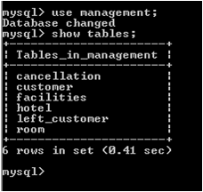
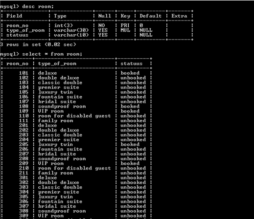
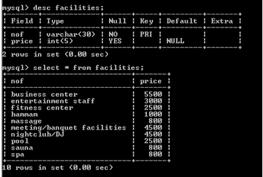
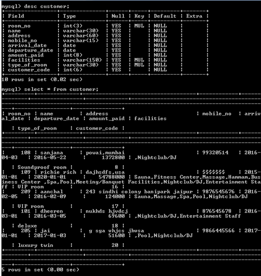
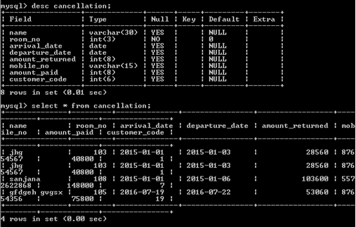

# Hotel-Reservation
Java application for Hotel Reservation and Management services

## Introduction

This project is aimed to create an online reservation system for ‘Hotel Marsellina’.
Customers can select the type of room and facilities they wish to avail for. The details provided by the user is stored in a MYSQL table, which in turn, returns the allotted room no. and a customer code to the customer.
The application also provides facilities for cancellation of reservation. The records in the MYSQL tables are altered accordingly and the amount returned is calculated from information in the tables and provided to the customer.

## ER Diagram

## Back End(MYSQL)
MYSQL has been used as the software for storage of data.
The images describing the structure of the tables is attached below.
### It is necessary to import the JDBC driver and describe all the tables in MYSQL in accordance with the ER Diagram for the smooth functioning of the application.

